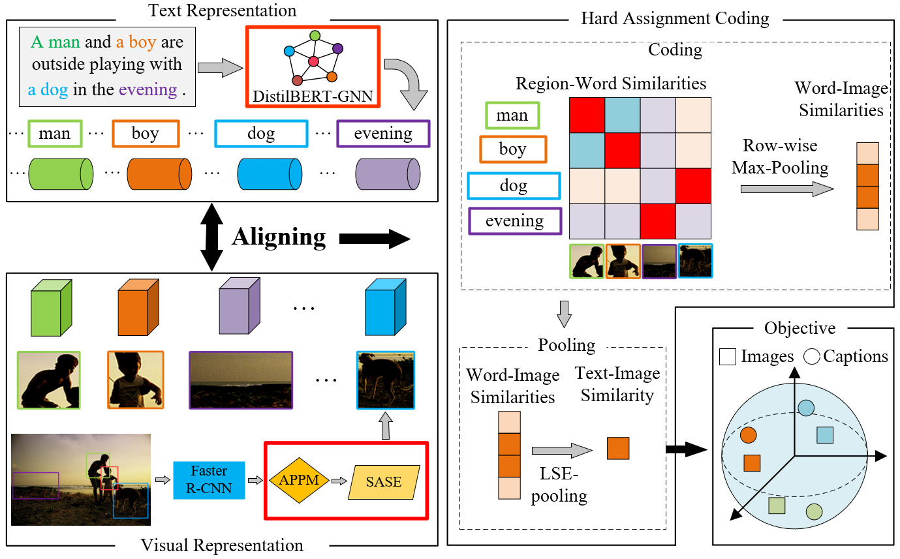

# Enhanced Cross-Modal Image-Text Matching via Hard Alignment and Multi-Scale Feature Fusion

## Introduction

This is the source code of CHAN-ASDG. It is built on top of the [VSEinf](https://github.com/woodfrog/vse_infty) in PyTorch. For a detailed explanation of the key code modules, please refer to our manuscript submitted to [The Visual Computer](https://link.springer.com/journal/371).



## Requirements and Installation

We recommended the following dependencies.

* Python 3.7
* [PyTorch](http://pytorch.org/) 1.11.0
* [Transformers](https://github.com/huggingface/transformers) (4.18.0)
* The specific required environment can be found [here](requirements.txt)

## Data

We organize all data used in the experiments in the same manner as [VSEinf](https://github.com/woodfrog/vse_infty):

```
data
├── coco
│   ├── precomp  # pre-computed BUTD region features for COCO, provided by SCAN
│   │      ├── train_ids.txt
│   │      ├── train_caps.txt
│   │      ├── ......
│   │
│   ├── images   # raw coco images
│   │      ├── train2014
│   │      └── val2014
│   │
│   └── id_mapping.json  # mapping from coco-id to image's file name
│   
│
├── f30k
│   ├── precomp  # pre-computed BUTD region features for Flickr30K, provided by SCAN
│   │      ├── train_ids.txt
│   │      ├── train_caps.txt
│   │      ├── ......
│   │
│   ├── flickr30k-images   # raw coco images
│   │      ├── xxx.jpg
│   │      └── ...
│   └── id_mapping.json  # mapping from f30k index to image's file name
│
│
└── vocab  # vocab files provided by SCAN (only used when the text backbone is BiGRU)
```

The download links for original COCO/F30K images, precomputed BUTD features, and corresponding vocabularies are from the offical repo of [SCAN](https://github.com/kuanghuei/SCAN#download-data). The ```precomp``` folders contain pre-computed BUTD region features, ```data/coco/images``` contains raw MS-COCO images, and ```data/f30k/flickr30k-images``` contains raw Flickr30K images. 

(Note: It seems that the download link for the pre-computed features in SCAN's repo is down, [this Dropbox link](https://www.dropbox.com/sh/qp3fw9hqegpm914/AAC3D3kqkh5i4cgZOfVmlWCDa?dl=0) provides a copy of these files. Please download and follow the above file structures to organize the data.)

The ```id_mapping.json``` files are the mapping from image index (ie, the COCO id for COCO images) to corresponding filenames, we generated these mappings to eliminate the need of the ```pycocotools``` package. 

Please download all necessary data files and organize them in the above manner, the path to the ```data``` directory will be the argument to the training script as shown below.

## Training

```bash
sh scripts/train.sh
```

## Evaluation

```bash
sh scripts/eval.sh
```

